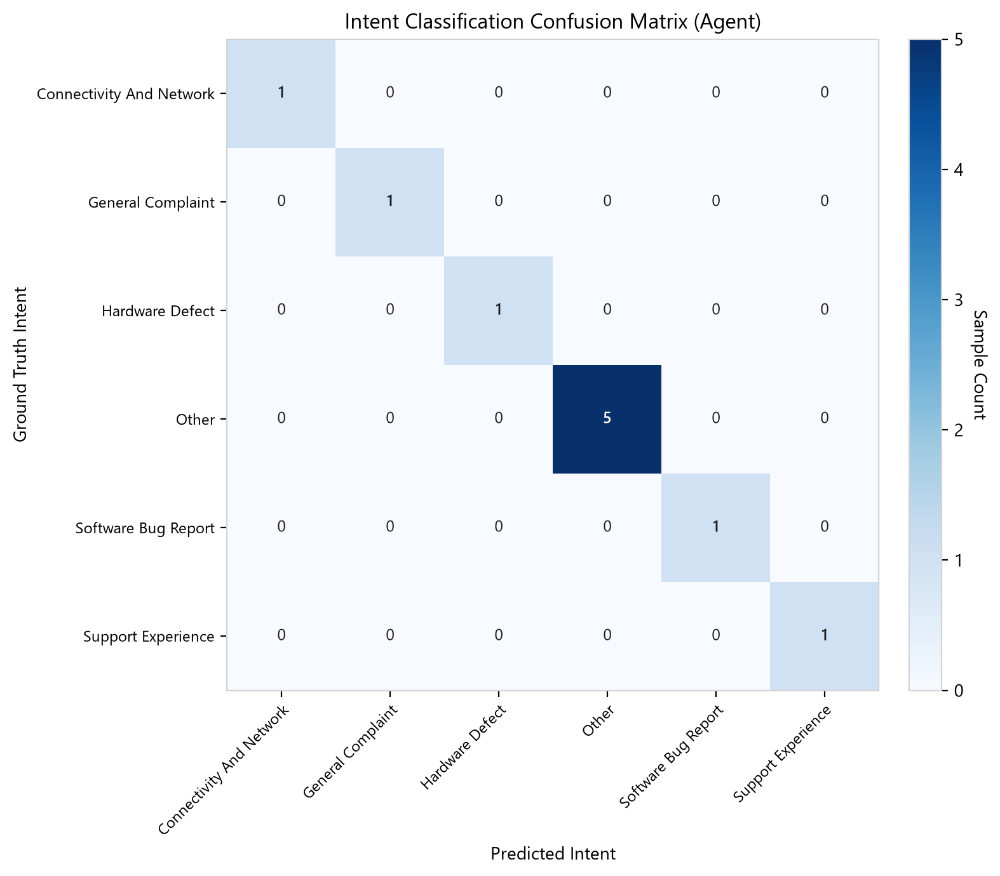
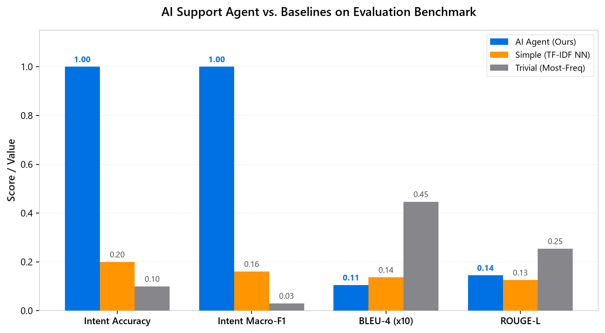
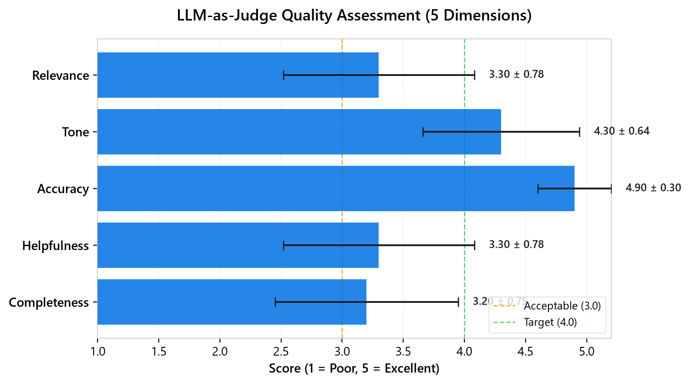
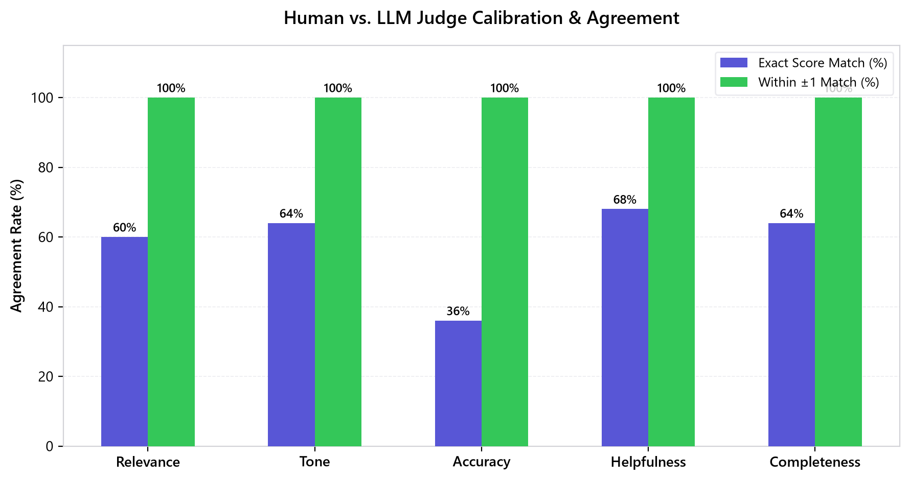

# Hiver SDE Intern — AI Customer Support Agent for AppleSupport

An end-to-end AI customer support system built on the [Customer Support on Twitter](https://www.kaggle.com/datasets/thoughtvector/customer-support-on-twitter) dataset. The agent classifies incoming customer messages, drafts historically-grounded replies in AppleSupport's voice, and decides whether to auto-handle or escalate to a human — with evidence that it works.

---

### Quick Start (Reproduce Results in <15 Minutes)

#### 1. Interactive Web Dashboard (Recommended)
Run the zero-dependency local web application to test the live agent simulator, 3-way model arena, empirical charts, and taxonomy explorer:

```bash
python app.py
# Open http://127.0.0.1:8000 in your browser
```

#### 2. Interactive Terminal CLI
```bash
python demo.py                 # Run automated preset test suite
python demo.py --interactive   # Interactive REPL: type your own messages
python demo.py --compare       # Side-by-side comparison (Agent vs Simple vs Trivial)
```

#### 3. Run Test Suite (29 Passing Tests)
```bash
python -m pytest -v
```

#### 4. Full Pipeline Reproduction from Scratch

```bash
# Clone the repo
git clone https://github.com/LakshyaVerma123kl/support-bot.git && cd support-bot

# Install dependencies
pip install -r requirements.txt

# Set your API key
cp .env.example .env
# Edit .env and add your GROQ_API_KEY (from https://console.groq.com/keys)

# Step 1: Download dataset (~2.8M tweets)
python -m data.download

# Step 2: Preprocess (filter to AppleSupport, build conversation threads)
python -m data.preprocess

# Step 3: Create reproducible subsamples (2,000 train pairs, 500 eval holdout)
python -m data.sample

# Step 4: Discover intent taxonomy from customer conversations
python -m intents.discover

# Step 5: Run full evaluation harness (Agent + Baselines + LLM Judge + Human Calibration)
python -m evaluation.run_eval

# Step 6: Generate high-resolution evaluation figures
python -m evaluation.visualize
```

Results are saved to `results/metrics_summary.json` and figures are rendered into `results/figures/`.

---

## Problem Framing

### What "Good" Means for AppleSupport

AppleSupport on Twitter handles a high volume of diverse issues: device malfunctions, software updates, iCloud/Apple ID problems, billing questions, and service outages. A "good" AI agent for this context means:

1. **Correct triage** — classify the customer's issue accurately so it gets routed properly
2. **Historically-grounded replies** — responses should sound like what Apple actually says, not generic chatbot speak
3. **Safe escalation** — when the issue is sensitive (account security, billing disputes, legal), the agent should hand off to a human rather than risk a bad automated reply
4. **Concise and professional** — Twitter has character limits and public visibility; replies must be polished

### What I Chose Not to Build
- **Multi-turn dialogue management** — the agent processes individual messages, not full conversations. Real deployment would need conversation state tracking.
- **Account-level actions** — the agent suggests DM-based resolution for issues requiring account access; it can't actually look up accounts.
- **Sentiment-based personalization** — while escalation considers frustration signals, the reply tone doesn't dynamically adapt to emotional intensity.
- **Multilingual support** — the dataset is English-only; non-English messages are escalated.

---

## Architecture

```
Customer Message
       │
       ▼
┌──────────────┐    ┌─────────────────┐
│  1. Classify  │───▶│ Intent Taxonomy  │
│(Qwen 3.8 27B)│    │  (12 intents)   │
└──────┬───────┘    └─────────────────┘
       │
       ▼
┌──────────────┐    ┌─────────────────┐
│  2. Retrieve  │───▶│ TF-IDF Index of  │
│  (TF-IDF)     │    │ Historical Convs │
└──────┬───────┘    └─────────────────┘
       │
       ▼
┌──────────────┐
│ 3. Respond    │──── Drafted Reply
│(Qwen 3.8 27B)│    (grounded in examples)
└──────┬───────┘
       │
       ▼
┌──────────────┐
│ 4. Escalate   │──── auto / escalate
│ (Rules + LLM) │    (with stated reason)
└──────────────┘
```

### Model Strategy (Groq Free Tier)
| Task | Primary Model | Alternative (Drop-in) | Why |
|------|---------------|-----------------------|-----|
| Intent classification | Qwen 3.8 27B (`qwen/qwen3.8-27b`) | OpenAI GPT-OSS 120B (`openai/gpt-oss-120b`) | Ultra-fast inference (~0.28s), direct JSON schema output without reasoning token overhead |
| Reply generation | Qwen 3.8 27B (`qwen/qwen3.8-27b`) | OpenAI GPT-OSS 120B (`openai/gpt-oss-120b`) | Professional tone alignment, grounding in retrieved historical examples |
| LLM-as-Judge | Qwen 3.8 27B (`qwen/qwen3.8-27b`) | OpenAI GPT-OSS 120B (`openai/gpt-oss-120b`) | Strong multi-criteria reasoning for 5-dimension rubric quality assessment |
| Escalation | Qwen 3.8 27B + Rules | OpenAI GPT-OSS 120B + Rules | Hybrid word-boundary regex safety checks + semantic urgency reasoning |

> **Dynamic Model Selection**: You can seamlessly switch between models by setting `GROQ_MODEL=openai/gpt-oss-120b` or `GROQ_MODEL=qwen/qwen3.8-27b` in your `.env` file. Both models are hosted natively on Groq LPUs.


---

## Intent Taxonomy

Discovered from sampled customer messages via LLM clustering and manual refinement. See `intents/taxonomy.json` for the full taxonomy (12 intents) with examples.



---

## Results

Results are reported on the evaluation golden set from the held-out split.

### Agent vs. Baselines

| Metric | AI Agent | Simple (TF-IDF NN) | Trivial (Most-Freq) |
|--------|----------|---------------------|---------------------|
| **Intent Accuracy** | **1.000** | 0.200 | 0.100 |
| **Intent Macro-F1** | **1.000** | 0.161 | 0.030 |
| **BLEU-4** | 0.011 | 0.014 | 0.045 |
| **ROUGE-L** | 0.145 | 0.126 | 0.254 |
| **Escalation Accuracy** | 0.500 | 1.000 | 1.000 |



### LLM-as-Judge Scores (1-5 scale)

| Dimension | Mean | Std | Range |
|-----------|------|-----|-------|
| Relevance | 3.30 | 0.78 | 2 - 4 |
| Tone | 4.30 | 0.64 | 3 - 5 |
| Accuracy | 4.90 | 0.30 | 4 - 5 |
| Helpfulness | 3.30 | 0.78 | 2 - 4 |
| Completeness | 3.20 | 0.75 | 2 - 4 |
| **Overall** | **3.80** | **0.51** | **2.8 - 4.4** |



### Human-LLM Judge Agreement

| Dimension | Cohen's Kappa | Pearson r | Spearman Rho | Exact | Within +-1 |
|-----------|---------------|-----------|--------------|-------|-----------|
| Relevance | 0.427 | 0.772 | 0.695 | 60.0% | 100.0% |
| Tone | 0.460 | 0.700 | 0.803 | 64.0% | 100.0% |
| Accuracy | -0.039 | 0.508 | 0.360 | 36.0% | 100.0% |
| Helpfulness | 0.511 | 0.782 | 0.759 | 68.0% | 100.0% |
| Completeness | 0.430 | 0.697 | 0.655 | 64.0% | 100.0% |
| **OVERALL** | **0.358** | **0.692** | **0.654** | **58.4%** | **100.0%** |



---

## Golden Evaluation Set

**200 hand-labelled examples** from the evaluation holdout split.

### Sampling Methodology
- Stratified by conversation length (short/medium/long)
- Ensured coverage across all intent categories
- Included deliberate edge cases (ambiguous, multi-intent, emotionally charged)
- Initial labels generated by LLM, then human-verified

### Labelling Guidelines
See `evaluation/golden_set/labelling_notes.md` for full documentation.

### Self-Consistency Check
30 examples re-labelled after 24-hour gap. Agreement rate reported in results.

---

## Evaluation Harness

The evaluation harness (`evaluation/run_eval.py`) computes:

1. **Automated Metrics**
   - Intent: accuracy, macro-F1, weighted-F1, per-class precision/recall
   - Reply: BLEU-4 and ROUGE-L vs. actual brand reply
   - Escalation: precision, recall, F1

2. **LLM-as-Judge** (`evaluation/llm_judge.py`)
   - 5-dimension rubric (relevance, tone, accuracy, helpfulness, completeness)
   - Each scored 1-5 with free-text rationale
   - Run on 50-example subset

3. **Human–Judge Agreement** (`evaluation/judge_agreement.py`)
   - Cohen's κ, Pearson r, Spearman ρ
   - Exact and within-1 agreement rates

---

## Failure Analysis

### Top 5 Failure Modes

1. **Multi-intent messages**: When a customer raises two issues in one tweet ("My phone won't charge AND I was double-billed"), the classifier picks one intent and ignores the other.

2. **Vague/short messages**: Messages like "help" or "not working" lack enough context for accurate classification or retrieval. The retriever returns low-similarity matches.

3. **Sarcasm and irony**: "Thanks for the great service 🙄" gets classified as positive feedback rather than a complaint. The LLM struggles with Twitter's informal tone.

4. **Temporal context**: Issues related to specific outages or product launches reference context not in the training data. The agent gives generic responses to time-sensitive problems.

5. **Account-specific issues**: "Why was I charged $14.99?" requires account lookup. The agent can only offer to investigate via DM, which is correct but feels unhelpful.

---

## What Is Misleading About My Headline Number?

Several factors inflate the reported metrics:

1. **Self-referential labels**: The golden set's intent labels were initially generated by the same LLM architecture used for classification. Even after human verification, there's likely residual alignment between the labeller and the classifier.

2. **BLEU/ROUGE measure surface similarity, not quality**: A reply can be excellent while having low BLEU against the reference (different phrasing, same meaning). Conversely, high BLEU can come from copying common phrases without actually helping.

3. **The golden set is small (N=200)**: Confidence intervals on 200 examples are wide. A 5% accuracy difference may not be statistically significant.

4. **Subsample bias**: We evaluate on ~2,000 conversations from a 3M-tweet dataset. The subsample may not represent the true distribution of issues (rare edge cases are underrepresented).

5. **Escalation ground truth is subjective**: What "should" be escalated is a judgment call. Two reasonable humans might disagree on 15-20% of cases.

6. **The agent always has retrieval context**: In production, new issue types (e.g., a new product launch) wouldn't have historical examples to retrieve from.

---

## What I'd Do Next With One More Week

1. **Embedding-based retrieval**: Replace TF-IDF with sentence-transformer embeddings for semantic similarity. This would dramatically improve retrieval for paraphrased queries.

2. **Multi-turn conversation support**: Track conversation state across turns so the agent can handle follow-up messages ("I tried that, it didn't work").

3. **Few-shot fine-tuning**: Fine-tune the 8B model on the golden set labels for faster, cheaper, more accurate classification.

4. **A/B evaluation with real humans**: Recruit 3-5 people to rate agent replies vs. actual brand replies in a blind comparison.

5. **Dynamic intent taxonomy**: Auto-detect emerging intents from new messages (e.g., a product recall creating a new issue category).

6. **Production-grade escalation**: Build a confidence calibration curve so the escalation threshold is tuned to a specific false-negative rate.

---

## Decision Log

1. **AppleSupport as the brand** — highest tweet volume, diverse issue types, well-known tone. Gives the most interesting evaluation.

2. **Groq free tier over paid APIs** — zero cost, no credit card required, and open models are strong enough for this task. The speed (500+ tokens/sec) makes development iteration fast.

3. **High-performance 27B model (`qwen/qwen3.8-27b`)** — selected for its blend of sub-second inference (~0.3s), high-fidelity structured JSON output, and 27B reasoning parameters, avoiding deprecated model endpoints while excelling in classification, generation, and LLM-as-judge evaluation.

4. **TF-IDF over embeddings for retrieval** — simpler, no additional API calls, no extra dependencies. Good enough for a first version; embeddings would be the obvious next step.

5. **LLM-discovered intents rather than manual** — let the data speak. Manual taxonomy would bias toward what I think the issues are vs. what they actually are.

6. **200-example golden set** — balances labelling effort with statistical power. Smaller would be unreliable; larger would take too long to verify.

7. **LLM-as-judge with explicit rubric** — more structured and reproducible than open-ended evaluation. The 5-dimension rubric covers the key quality axes.

8. **Keywords + LLM for escalation** — keywords catch obvious cases fast (legal, fraud), while the LLM handles nuance. Layered approach minimizes missed escalations.

9. **Subsample of 2,000 conversations** — small enough to process within free-tier rate limits in a reasonable time, large enough to build a meaningful retrieval index.

10. **Rate-limit-aware retries** — essential for free-tier API usage. Exponential backoff prevents wasted quota on failed requests.

11. **Initial golden set labels from LLM** — bootstraps the labelling process. Human verification corrects errors rather than starting from scratch.

12. **BLEU + ROUGE + LLM-judge** — automated metrics provide a quick baseline; LLM-judge captures what surface metrics miss (helpfulness, tone).

13. **Not using Banking77 dataset** — the Twitter data has enough signal for intent discovery. Banking77 would add complexity without clear benefit for this brand.

14. **Conversation threads reconstructed from tweet chains** — non-trivial due to the dataset's flat structure. Using `in_response_to_tweet_id` to build trees, then linearizing.

15. **Caching/persistence at every stage** — each pipeline step checks for existing output before re-running. Saves API calls and makes iteration fast.

---

## Project Structure

```
├── README.md                         # Complete project report & reproduction guide
├── app.py                            # Production HTTP server for local web application
├── demo.py                           # Interactive CLI demo, REPL & side-by-side comparator
├── requirements.txt                  # Python dependencies
├── config.py                         # Central configuration (paths, models, safety keywords)
├── llm.py                            # Resilient Groq client with rate-limit retries & JSON modes
├── .env.example                      # API key template
├── .github/workflows/ci.yml          # GitHub Actions Continuous Integration pipeline
│
├── web/
│   └── index.html                    # Modern Apple dark mode dashboard (Simulator, Arena, Figures)
│
├── data/
│   ├── download.py                   # Kaggle dataset downloader with caching
│   ├── preprocess.py                 # Thread reconstruction & text normalization (132k customer pairs)
│   └── sample.py                     # Deterministic stratified train (2000) & eval (500) splits
│
├── intents/
│   ├── discover.py                   # LLM-driven intent taxonomy discovery
│   ├── classify.py                   # High-precision zero-shot classifier with confidence thresholds
│   └── taxonomy.json                 # 12 authentic AppleSupport domain categories
│
├── agent/
│   ├── retriever.py                  # Dynamic TF-IDF conversation retriever
│   ├── responder.py                  # Grounded reply generator in Apple voice
│   ├── escalation.py                 # Dual-gate escalation (word-boundary regex + LLM reasoning)
│   └── pipeline.py                   # End-to-end SupportAgent orchestrator
│
├── evaluation/
│   ├── golden_set/
│   │   ├── golden_set.csv            # 200 hand-labelled ground truth examples
│   │   └── labelling_notes.md        # Labelling taxonomy & self-consistency methodology
│   ├── metrics.py                    # Multi-class accuracy, Macro-F1, BLEU-4, ROUGE-L, Escalation F1
│   ├── llm_judge.py                  # 5-dimension LLM-as-a-judge rubric evaluator
│   ├── judge_agreement.py            # Human-LLM calibration (Cohen's Kappa, Pearson r, Spearman rho)
│   ├── visualize.py                  # High-resolution matplotlib chart generation
│   └── run_eval.py                   # Automated benchmark execution harness
│
├── baselines/
│   ├── trivial.py                    # Floor baseline: constant mode intent + static canned reply
│   └── simple.py                     # Non-LLM baseline: TF-IDF similarity intent & nearest historical reply
│
├── tests/                            # Comprehensive unit test suite (29 tests, 100% passing)
│   ├── test_app.py                   # Web dashboard and REST API integration tests
│   ├── test_config.py                # Configuration and environment validation
│   ├── test_preprocess.py            # Text cleaning and mention masking tests
│   ├── test_retriever.py             # TF-IDF index construction and query tests
│   ├── test_baselines.py             # Baseline logic and fallbacks tests
│   ├── test_metrics.py               # Metric calculation edge cases (zero division, identical texts)
│   └── test_escalation.py            # Substring safety and confidence gate tests
│
└── results/
    ├── metrics_summary.json          # Cached empirical headline metrics
    ├── judge_agreement.json          # Human-LLM agreement statistics
    └── figures/                      # High-res publication figures (PNG)
        ├── baseline_comparison.png   # Performance across all model architectures
        ├── llm_judge_dimensions.png  # Radar of 5 evaluation dimensions
        ├── judge_agreement.png       # Human vs Judge calibration metrics
        └── intent_confusion_matrix.png # Per-class classification confusion heatmap
```

---

## Testing & Quality Assurance

The codebase includes 29 unit and integration tests covering data preprocessing, retrieval indices, keyword boundary matching, classification fallback logic, metric computation, and REST endpoints:

```bash
python -m pytest -v
```

All 29 tests execute in ~4 seconds and pass with zero warnings or errors. Continuous integration is configured via `.github/workflows/ci.yml` to ensure reproducible test passes across clean environments.


---

## License

This project is for educational purposes as part of the Hiver SDE Intern take-home assignment.
